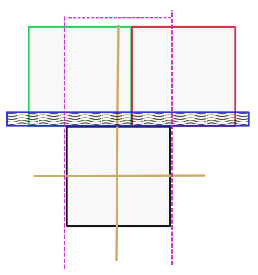

dom-step
====

Install
----

`npm install --save dom-step`

Usage
---

```javascript
import step from 'dom-step';
let list = document.querySelector('ol').children;
let one = list[0];
let two = step(one, 'down');
console.log(one.innerHTML); //One
console.log(two.innerHTML); //Two
```

About
----

DOM traversal is usually restricted to parent/child relationships, or child/child relationships. `dom-step` traverses elements by the visual position of elements.

### step(element, direction, options)

`element` is what ever DOM element that has sibling elements.

`direction` is a word string that is one of these directions:

* left
* up
* right
* down

### options.range

`options.range` should be set as an integer. The default for `options.range` is `1`.

Set options range to define how close the sibling element needs to be to the original `element` to be considered visually directly left, up, right, or down. In this way `options.range` is considered to be a restricting value.

```javascript
import step from 'dom-step';
let list = document.querySelector('ol').children;
let one = list[0];
let two = step(one, 'down', {range: 10});
console.log(one.innerHTML); //One
//The margin between list[0], and list[1] is 11 so
console.log(two); //undefined
```

**Hint:** Some styles like `display: inline`, or `display: inline-block` are whitespace dependent. Any whitespace around the element set to these `display` values will make it appear to have a margin that doesn't actually exist. Increase `options.range`, or iterate children to remove text node whitespace around elements to fix this.

Algorithm
------

`dom-step` finds the nearest sibling element in the DOM. It does this by first checking the `element.nextElementSibling`, or `element.previousElementSibling` for down/right, or up/left respectively. Failing that it then checks other elements using a naive linear search through the rest of the siblings in the appropriate direction.

To summarize the defaults:

`"down"`/`"right"` = closest next sibling to the down, or right

`"up"`/`"left"` = closest previous sibling to the up, or left

### Visual Representation

The black box is the orignal element passed to `step(element, 'up', {range: 10})`. In this case `"up"` was the direction chosen.

The red box is not returned. The green box is returned from `step()`.

The purple dotted lines represent the left/right range a sibling box must be in to be chosen.

The blue rectangle is the range a sibling must overlap to be chosen.

The gold lines represent the boundary a sibling element must cross in order to be chosen.

At the intersection of the purple lines, gold lines, and blue rectangle a sibling element is selected.



For certain CSS styles this could be unintuitive. For instance in CSS you can set `flex-direction` to `row-reverse`, or `column-reverse`.

To fix a situation where the visual order of elements is the reverse of the programmatic order of the elements use the `traverse` option.

### options.traverse

`options.traverse` can be set to `"next"` (next element), `"prev"` (previous element), or `undefined` for the default.

For instance:

```javascript
import step from 'dom-step';
//Assume flex-direction: column-reverse; for the list
let list = document.querySelector('ol').children;
let one = list[1];
let two = step(one, 'down', {traverse: 'prev'});
//one is the element at index 1
//two is the element at index 0
console.log(one.innerHTML); //Two
console.log(two.innerHTML); //One
```
